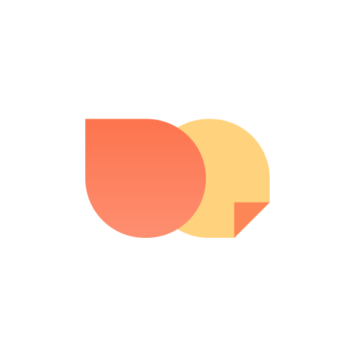
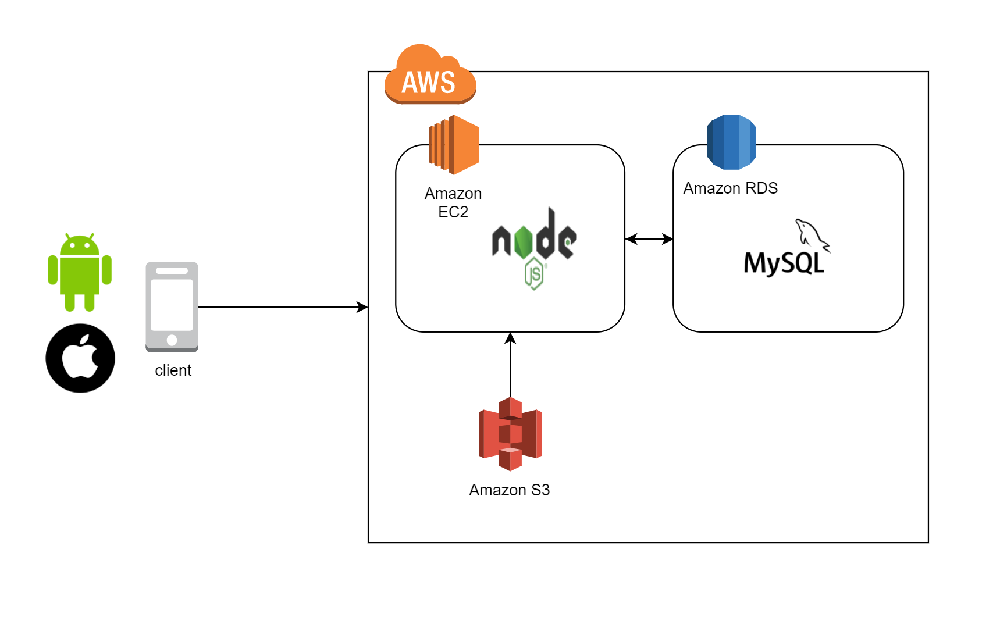

<h1 align="center"> Cozy_server  </h1>


<p align="center">
<div align="center" style="display:flex;">
	
</div>
  바쁜 도심 속 휴식처, 공간과 경험을 파는 세상의 모든 독립서점 📚
</p>


* <b> SOPT 26th APPJAM
    
* 프로젝트 기간: 2020.06.27 ~ 2020.07.18

* [API 문서](https://github.com/OurCozy/cozy-server/wiki)</b>

<br>

# 1. Cozy란?

<b>바쁜 도심 속 휴식처, 공간과 경험을 파는 세상의 모든 독립서점 📚, Cozy 입니다.</b>
<br>
코지(Cozy)는 분산화되어있는 다양한 독립서점의 정보들을 모아놓고, 정보 큐레이션 및 리뷰를 위해 만들어진 서비스 입니다.
</br>

<br>

# 2. Main Function

* 북마크 순으로 정렬된 상위 8개 독립 서점 추천
* 서점별 상세 정보 제공
* 지역별 독립 서점 조회
* 관심 책방 등록 및 조회
* ? 후기 작성 및 조회
* ? 키워드 검색
* ? 최근 본 책방 조회

# 3. Server Architecture  
<div align="center" style="display:flex;">
	
</div>


# 4. ER Diagram  

<div align="center" style="display:flex;">
	
</div>

# 5. dependencies module (package.json)

👇 사용 패키지(모듈)

```json
"dependencies": {
    "aws-sdk": "^2.710.0",
    "body-parser": "^1.19.0",
    "cookie-parser": "^1.4.5",
    "crypto": "^1.0.1",
    "debug": "^2.6.9",
    "express": "^4.16.4",
    "http-errors": "^1.6.3",
    "jade": "^1.11.0",
    "jsonwebtoken": "^8.5.1",
    "morgan": "^1.9.1",
    "multer": "^1.4.2",
    "multer-s3": "^2.9.0",
    "nodemon": "^2.0.4",
    "pbkdf2": "^3.1.1",
    "promise-mysql": "^4.1.3",
    "rand-token": "^1.0.1"
  }
}

```
- **aws-sdk** : ?
- **crypto** : 패스워드 암호화 및 인증 
- **express** : 웹,서버 개발 프레임워크
- **jsonwebtoken** : JWT(Json Web Token) 생성 및 인증 
- **multer** : 파일 업로드 도구
- **multer-s3** : AWS S3 파일 업로드 도구
- **nodemon** : ?
- **pbkdf2** : ?
- **promise-mysql** : ?
- **rand-token** : 랜덤 토큰 생성 도구
 

# 6. 사용된 도구

* [Node.js](https://nodejs.org/ko/)
* [Express.js](http://expressjs.com/ko/) 
* [Visual Studio Code](https://code.visualstudio.com/) - Node.js editor
* [NPM](https://rometools.github.io/rome/) - 자바 스크립트 패키지 관리자
* [MySQL](https://www.mysql.com/) - MySQL DB
* [MySQL Workbench](https://www.mysql.com/products/workbench/) - MySQL editor


# 7. 배포

* AWS EC2 - 클라우드 컴퓨팅 시스템
* AWS S3 - 클라우드 데이터 저장소

# 8. Team Role

####  김가인📕

- 로그인, 회원가입, 프로필 사진 업데이트, 내 정보 조회 기능 구현
- 지역별 조회 기능 구현
- API 명세서 작성 

####  홍민정📗

- DB 설계
- 이미지 업데이트, 관심 책방 조회 기능 구현
- API 명세서 작성

####  정형일📘

- 책방 소개, 책방 자세히 기능 구현
- README.md 작성


