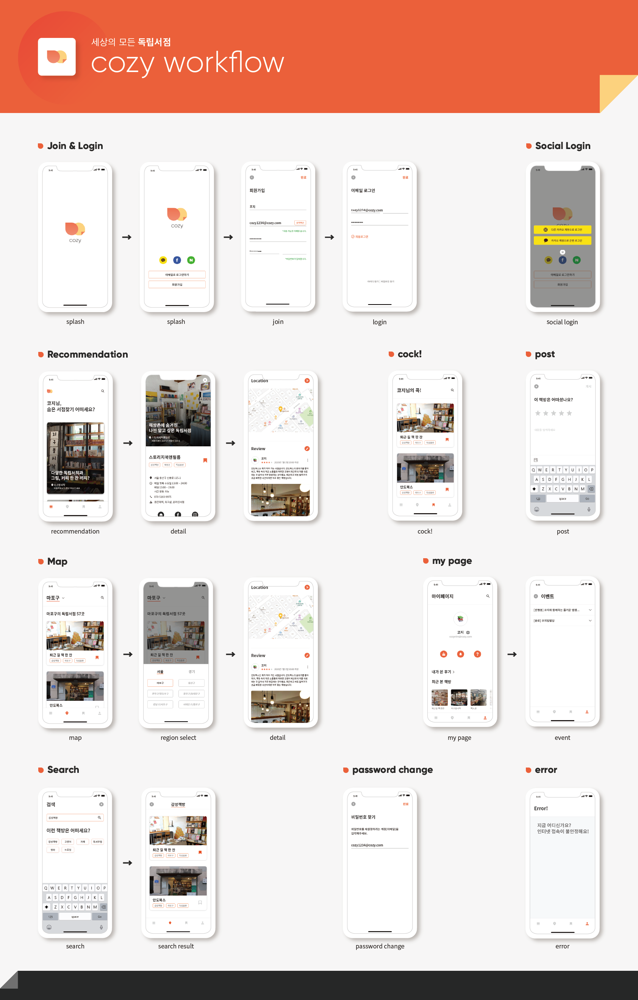
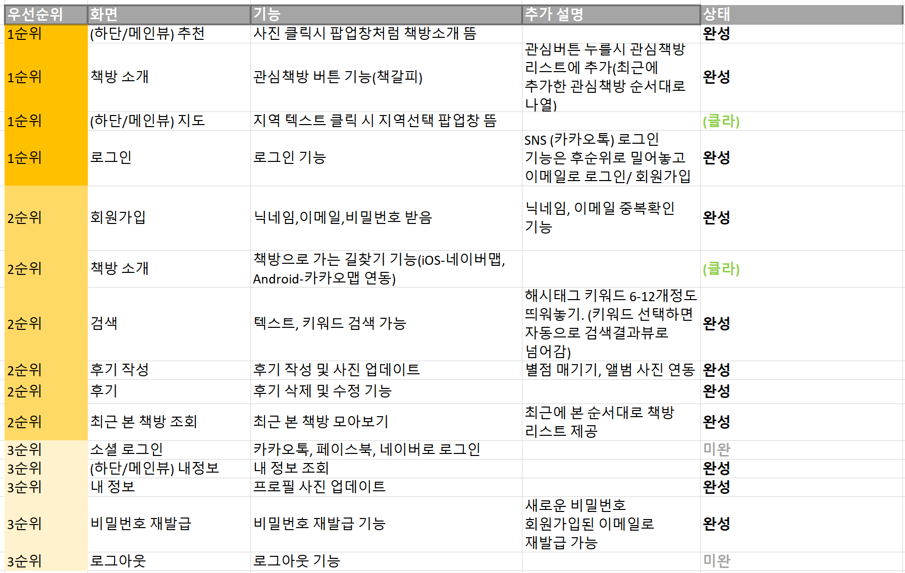
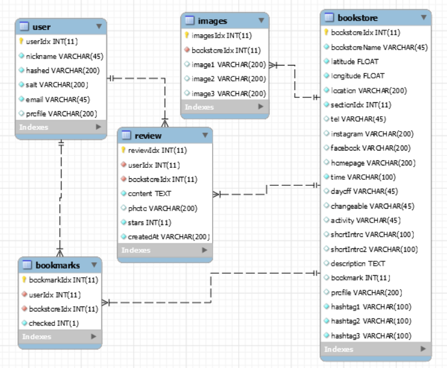

<h1 align="center"> 📌Cozy SERVER_콕❗ </h1>


<p align="center">
<div align="center" style="display:flex;">
	
</div>
  </br>
  세상의 모든 독립서점, Cozy 📚
</p>

* <b> SOPT 26th APPJAM
    
* 프로젝트 기간: 2020.06.27 ~ 2020.07.18

* [API 명세서](https://github.com/OurCozy/cozy-server/wiki/HOME%F0%9F%93%9A)

* [Notion](https://www.notion.so/75d5a7f9c7c345f0984ed7661c79e0a2)</b>

</br>

<div align="center" style="display:flex;">
	
</div>

</br>

# 1. Cozy란? 📚

<b>세상의 모든 독립서점, Cozy📚 입니다.</b>
<br>
코지(Cozy)는 분산화되어있는 다양한 독립서점의 정보들을 모아놓고, 정보 큐레이션 및 리뷰를 위해 만들어진 서비스 입니다.
</br>

<br>

# 2. Team Core Value 👬👭

- 책임감 💪
  - 약속 시간 지키기 
  - 맡은 일 다하기
  - 서로의 업무 공유하기
  - 답장 열심히 하기
- 존중 🙏
  - 서로의 일에 관심을 갖고 많은 얘기 나누기
  - 힘들고 지친 순간에도 팀원을 배려하기
- 편안함 🤸‍♀️
  - 앱잼 즐기기 ❗❗

<br>

# 3. Main Function 📚

- 북마크 순으로 정렬된 상위 8개 독립 서점 추천
- 서점별 상세 정보 제공
  - 관심 책방 등록 및 조회
  - 후기 작성
  - 후기 조회
- 지역별 독립 서점 조회
- 내 정보 조회
  - 최근 본 책방 조회
  - 내가 쓴 후기 조회
- 키워드 및 텍스트로 책방 검색


# 3 - 1 Function detail

<div align="center" style="display:flex;">
	
</div>

# 4. Server Architecture  
<div align="center" style="display:flex;">
	
</div>


# 5. ER Diagram  

<div align="center" style="display:flex;">
	
</div>

# 6. dependencies module (package.json)

👇 사용 패키지(모듈)

```json
"dependencies": {
    "aws-sdk": "^2.710.0",
    "body-parser": "^1.19.0",
    "cookie-parser": "^1.4.5",
    "crypto": "^1.0.1",
    "debug": "^2.6.9",
    "express": "^4.16.4",
    "http-errors": "^1.6.3",
    "jade": "^1.11.0",
    "jsonwebtoken": "^8.5.1",
    "moment": "^2.27.0",
    "moment-timezone": "^0.5.31",
    "morgan": "^1.9.1",
    "multer": "^1.4.2",
    "multer-s3": "^2.9.0",
    "nodemailer": "^6.4.10",
    "nodemailer.js": "0.0.2-security",
    "nodemon": "^2.0.4",
    "pbkdf2": "^3.1.1",
    "promise-mysql": "^4.1.3",
    "rand-token": "^1.0.1"
  }
}

```
- **aws-sdk** : 비차단 I/O 지원, 향상된 시작 성능 및 페이지 매김 응답을 통한 자동 반복과 같이 자주 요청된 다수의 기능
- **crypto** : 패스워드 암호화 및 인증 
- **express** : 웹,서버 개발 프레임워크
- **jsonwebtoken** : JWT(Json Web Token) 생성 및 인증 
- **multer** : 파일 업로드 도구
- **multer-s3** : AWS S3 파일 업로드 도구
- **nodemon** : node.js 서버 개발시에 소스코드에 수정이 있을 경우, 자동으로 서버를 다시 시작해주는 툴
- **pbkdf2** : hash 를 생성할 때 마다 다른 salt 를 사용하지만, 암호화를 할 때 사용했던 salt 를 그대로 사용하면 hash 값도 같기 때문에 이를 활용해 비밀번호를 안전하게 저장
- **promise-mysql** : async/await를 편하게 사용하기 위한 모듈
- **rand-token** : 랜덤 토큰 생성 도구
- **nodemailer** : e-mail을 쉽게 보낼 수 있게 도와주는 모듈
- **moment** : 날짜와 시간을 다루는 모듈

# 7. 사용된 도구

* [Node.js](https://nodejs.org/ko/)
* [Express.js](http://expressjs.com/ko/) 
* [Visual Studio Code](https://code.visualstudio.com/) - Node.js editor
* [NPM](https://rometools.github.io/rome/) - 자바 스크립트 패키지 관리자
* [MySQL](https://www.mysql.com/) - MySQL DB
* [MySQL Workbench](https://www.mysql.com/products/workbench/) - MySQL editor


# 8. 배포

* AWS EC2 - 클라우드 컴퓨팅 시스템
* AWS S3 - 클라우드 데이터 저장소
* AWS RDS - 클라우드 환경 데이터베이스 관리 시스템

# 9. Team Role

####  김가인📕

<div align="left" style="display:flex;">
	
</div>

- 로그인, 회원가입, 토큰 인증
- 내 프로필 사진 업데이트, 내 정보 조회 기능 구현
- 지역별 조회 기능 구현
- 북마크 업데이트 기능 구현
- 키워드 및 텍스트 검색 구현
- 최근 본 책방 구현
- API 명세서 작성

####  홍민정📗

<div align="left" style="display:flex;">
	
</div>

- DB 설계
- 비밀번호 찾기, 이메일 및 닉네임 중복 확인 구현
- 책방 이미지 업데이트
- 관심 책방 조회 기능 구현
- 후기 작성, 조회, 수정, 삭제 기능 구현
- 후기 이미지 업로드 기능 구현
- API 명세서 작성

####  정형일📘

<div align="left" style="display:flex;">
	
</div>

- DB 설계
- 상위 8개 독립 서점 추천 구현
- 책방 자세히 보기 기능 구현
- API 명세서 작성
- README.md 작성
- 유지 보수
